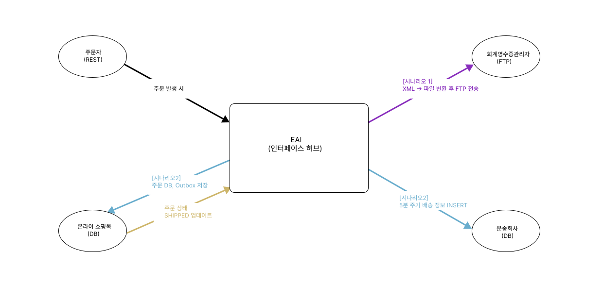

# EAI 데이터 플로우



---

## 시나리오 1 — 주문 실시간 처리 (IF-ORD-001)

```
주문자(REST)
  │
  │  POST /api/orders  [XML Payload, X-Applicant-Key 헤더]
  ▼
[검증]
  · XML 본문 존재 여부 확인
  · APPLICANT_KEY 헤더 누락 여부 확인
  │
  ▼
[변환 — XML → OrderRow[]]
  · XML <HEADER> / <ITEM> 파싱
  · 주문번호 채번 (A000~Z999 순환)
  · 수신 시각 기록
  │
  ▼
[라우팅 — 하나의 DB 트랜잭션으로 처리]
  ├─ Oracle ORDER_TB INSERT   (주문 원본 저장)
  └─ H2 OUTBOX INSERT         (영수증 파일 내용 저장, SEND_STATUS='N')
  │
  ▼
[OutboxRelay — FTP 전송]
  · 파일 포맷: 필드를 ^ 구분자로 연결한 텍스트
  · 파일명: INSPIEN_{지원자명}_{yyyyMMddHHmmss}.txt
  · 전송 성공 → OUTBOX.SEND_STATUS = 'Y'
  · 전송 실패 → OUTBOX.RETRY_COUNT + 1, 60초 후 재시도
  · 3회 초과  → H2 DLQ INSERT (STATUS='WAIT'), 정상 흐름과 분리
  │
  ▼
회계명수증관리자(FTP)
```

모든 단계(수신·변환·완료·실패·FTP 결과)는 `INTEGRATION_HISTORY`에 `correlationId` 기준으로 기록됩니다.

---

## 시나리오 2 — 배송 배치 처리 (IF-SHP-001)

```
@Scheduled (5분 주기, 서버 기동 시점부터 카운트)
  │
  ▼
[미배송 주문 조회]
  · Oracle ORDER_TB에서 STATUS='N' 인 주문 최대 200건 조회
  · 대상 없으면 해당 회차 스킵
  │
  ▼
[변환 — OrderRow[] → ShipmentRow[]]
  · 주문 정보를 배송 스키마에 맞게 재구성
  │
  ▼
[라우팅 — 건별 독립 트랜잭션]
  ├─ Oracle SHIPMENT_TB INSERT  (배송 정보 적재)
  └─ Oracle ORDER_TB UPDATE     (STATUS = 'Y', 배송 완료 표시)
  · 한 건 실패해도 나머지 건은 계속 처리
  │
  ▼
운송회사(DB)  +  온라인 쇼핑몰(DB) 상태 반영
```

모든 처리 결과는 `INTEGRATION_HISTORY`에 기록됩니다. 개별 건 실패 시 해당 건만 WARN 이력으로 남기고 배치는 계속 진행합니다.
